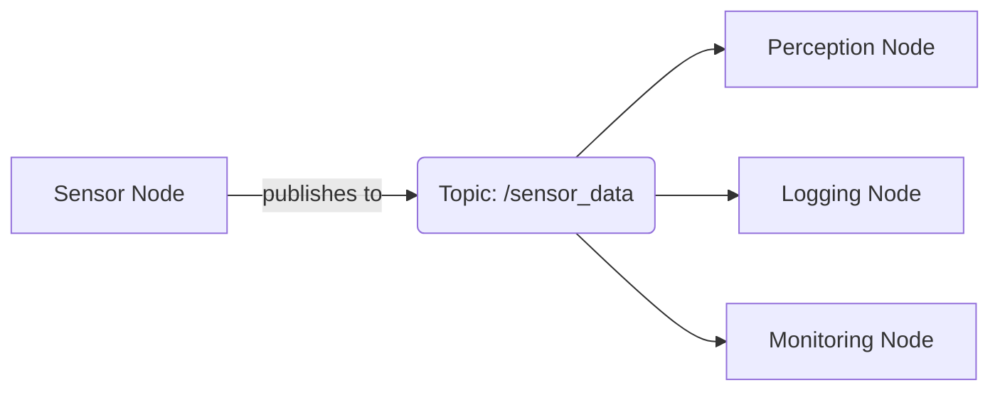

# Chapter 1: ROS 2 Fundamentals

## Introduction to ROS 2

ROS 2 (Robot Operating System 2) is a flexible framework for writing robot software. It's a collection of tools, libraries, and conventions that aim to simplify the task of creating complex and robust robot behavior across a wide variety of robot platforms.

Unlike traditional software systems, ROS 2 is designed specifically for the distributed nature of robotic systems, where multiple sensors, actuators, and computational units need to work together seamlessly.

## The Role of ROS 2 in Physical AI

ROS 2 serves as the middleware "nervous system" that connects AI agents to physical robot control systems. This enables AI algorithms to interact with the physical world through robotic platforms. The middleware architecture allows:

- **Decoupling**: AI algorithms can be developed independently from low-level hardware control
- **Communication**: Seamless data exchange between perception, decision-making, and actuation systems
- **Scalability**: Easy integration of new sensors, actuators, or algorithmic components

This architecture is particularly important for humanoid robots, where multiple subsystems must coordinate in real-time to achieve complex behaviors.

## Core Concepts: Nodes, Topics, and Services

### Nodes

A **node** is an executable that uses ROS 2 to communicate with other nodes. In a typical robot system, you might have nodes for:

- Sensor drivers (camera, lidar, IMU)
- Perception algorithms (object detection, SLAM)
- Planning algorithms (motion planning, path planning)
- Control systems (motor controllers, joint control)
- User interfaces

Nodes are the fundamental building blocks of a ROS 2 system, and each node typically performs a specific function.

### Topics and Message Passing

**Topics** are named buses over which nodes exchange messages. This implements a publish-subscribe communication pattern:

- **Publishers** send data to a topic
- **Subscribers** receive data from a topic
- Communication is asynchronous and loosely coupled

This pattern is ideal for sensor data distribution, where multiple nodes might need to consume the same sensor readings, or for broadcast commands.

### Services

**Services** provide synchronous request-reply communication between nodes. This is used for:

- Actions that require acknowledgment (e.g., "move to position X, Y, Z")
- Operations that have a clear start and end
- Request-response patterns where the client waits for a result

Services complement the asynchronous nature of topics with synchronous operations when needed.

## Message-Based Robot Control

ROS 2 uses a message-based architecture for robot control, which offers several advantages:

### Standardized Communication

Messages in ROS 2 have standardized formats defined in `.msg` files. This ensures:

- Consistent data exchange between nodes
- Automatic serialization/deserialization
- Language-agnostic communication (C++, Python, etc.)

### Distributed Control Architecture

The message-based approach enables:

- **Modularity**: Each component can be developed and tested independently
- **Flexibility**: Components can be swapped or updated without affecting others
- **Robustness**: Failure of one node doesn't necessarily bring down the entire system

### Real-World Example: Moving a Robot Arm

Consider a simple scenario where an AI agent wants to move a robot arm to grasp an object:

1. **Perception Node** publishes camera data to `/camera/image_raw`
2. **Object Detection Node** subscribes to camera data, detects the object, and publishes its coordinates to `/object_location`
3. **Planning Node** subscribes to object location, computes a motion plan, and sends it via service call to `/move_arm`
4. **Controller Node** receives the motion plan and executes it on the physical hardware

This distributed approach allows each component to specialize while maintaining overall system coherence.

## Quality of Service (QoS) Settings

ROS 2 introduces Quality of Service settings that allow fine-tuning of communication behavior:

- **Reliability**: Reliable vs. best-effort delivery
- **Durability**: Volatile vs. transient-local durability for late-joining subscribers
- **History**: Number of messages to keep in history
- **Rate**: Desired publication rate

These settings are crucial for real-time robotic applications where timing and reliability requirements vary by message type.

## Summary

In this chapter, we've covered the fundamental concepts of ROS 2:

- ROS 2 acts as a middleware nervous system connecting AI agents to robot control
- The core architecture consists of nodes, topics, and services
- Message-based communication enables modular, distributed robot control
- Quality of Service settings allow optimization for specific requirements

Understanding these concepts is crucial for working with ROS 2 systems and forms the foundation for the more advanced topics in the following chapters.

## Learning Objectives Review

After completing this chapter, you should be able to:
- Explain the role of ROS 2 in connecting AI agents to robot control systems
- Describe the differences between nodes, topics, and services
- Understand how message-based communication enables robot control
- Recognize the advantages of distributed architecture in robotics

## Next Steps

Continue to [Chapter 2: Python Agents with rclpy](./chapter-2-python-agents-rclpy.md) to learn how to implement ROS 2 nodes in Python and bridge AI logic to robot controllers.